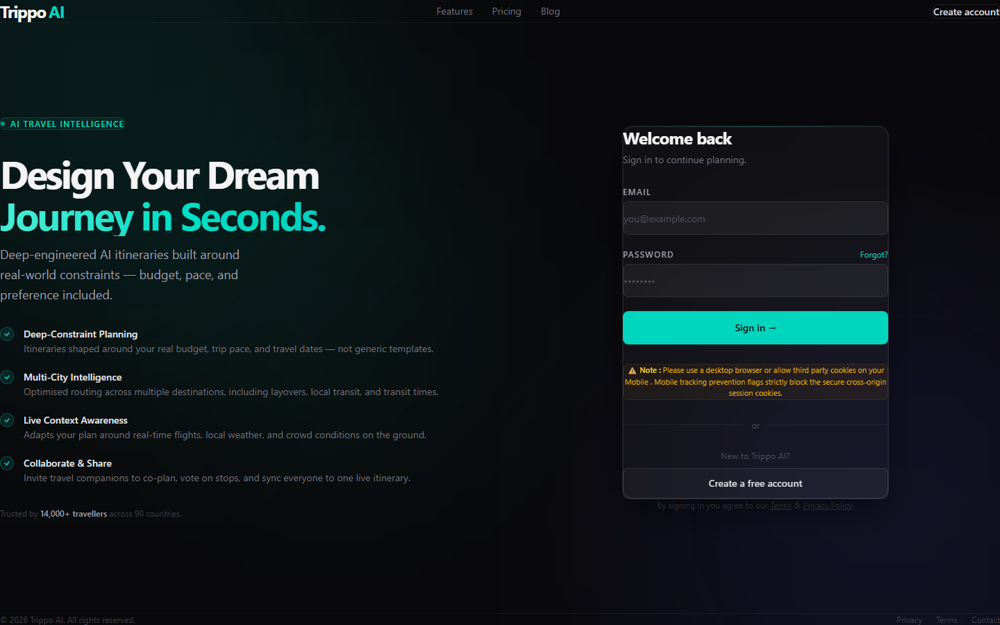
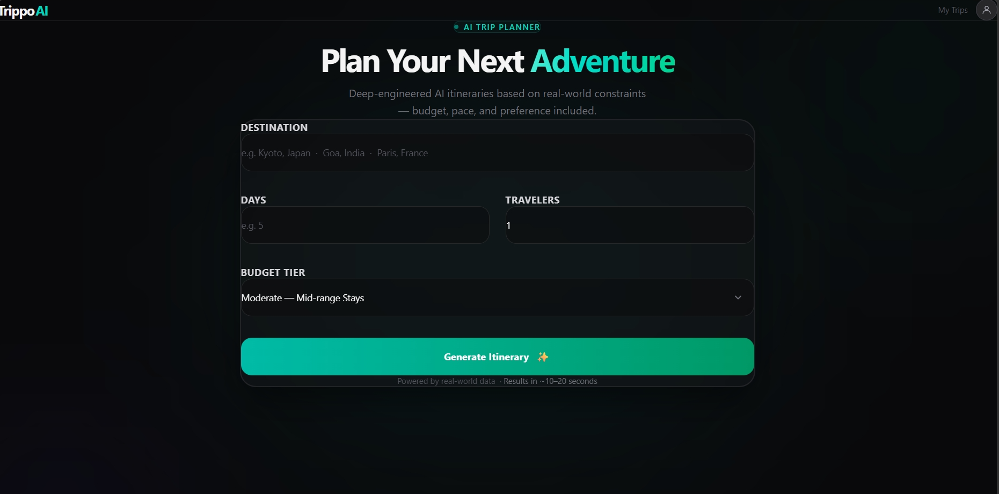

# Trippo AI

Trippo AI is a full-stack, AI-driven travel planning application that autonomously generates personalized, geographically clustered itineraries. By enforcing structured output formats from Google Gemini, the platform dynamically converts user constraints—such as destination, budget, duration, and party size—into structured day-by-day JSON plans. The system features a robust Node.js backend with JWT authentication, MongoDB for data persistence, and an in-memory PDF export pipeline.

## Overview

Trippo AI eliminates the friction of manual trip research by transforming user preferences into highly practical, ready-to-use travel itineraries. The engineering focus of this project revolves around:
- Enforcing structured LLM output for deterministic frontend rendering.
- Implementing secure, stateful session handling via HTTP-only cookies and token blacklisting.
- Architecting a lightweight, zero-disk-write PDF generation pipeline.
- Delivering a high-performance UI by selectively querying lightweight data payloads.

## Key Features

- **AI-Powered Itinerary Generation**  
  Context-aware itinerary creation utilizing Google Gemini 2.5 Flash, dynamically factoring in constraints such as budget, duration, and traveler count.
- **Geographical Clustering**  
  Systematic grouping of daily activities by geographic proximity to optimize travel time and logical pacing.
- **Structured Output Enforcement**  
  Explicitly enforces `application/json` output configurations within the LLM API to guarantee predictable and crash-free data parsing.
- **Secure Authentication Pipeline**  
  JWT-based authentication leveraging `httpOnly` cookies, complemented by a MongoDB-backed token blacklist to ensure definitive logout invalidation and mitigate XSS risks.
- **In-Memory PDF Export**  
  Generates travel brochures server-side using Headless Puppeteer, streaming dynamic A4 PDF buffers directly to the client without executing intermediate disk writes.
- **Saved Trip Management**  
  Persists generated JSON itineraries in MongoDB, allowing authenticated users to retrieve and manage their travel history seamlessly.

## Tech Stack

**Frontend:** React.js, Vite, Tailwind CSS, React Router  
**Backend:** Node.js, Express.js, MongoDB (Mongoose)  
**AI & Utilities:** Google Gemini API (`@google/genai`), Puppeteer, JSON Web Tokens (JWT), bcryptjs

## Architecture / Workflow

1. **Constraint Ingestion:** The React frontend captures user-defined trip parameters.
2. **Secure Request:** Authenticated requests are verified via HTTP-only cookies by Express middleware.
3. **AI Orchestration:** The backend constructs an explicit prompt and requests a strictly typed JSON response from the Google Gemini API.
4. **Persistence:** The generated structured itinerary is saved to MongoDB.
5. **Client Rendering:** The frontend maps the JSON payload to a highly responsive, glassmorphic UI.
6. **Asset Delivery (Optional):** If requested, the backend converts the JSON itinerary into an HTML template, renders it via Puppeteer, and streams an A4 PDF buffer back to the user.

## Folder Structure

```text
TrippoAI/
├── Backend/
│   ├── src/
│   │   ├── config/          # Database configuration
│   │   ├── controllers/     # Route logic (auth, trip)
│   │   ├── middlewares/     # JWT verification & token blacklisting
│   │   ├── models/          # Mongoose schemas (User, Trip, Blacklist)
│   │   ├── routes/          # API endpoint definitions
│   │   └── services/        # External integrations (Gemini, Puppeteer)
│   ├── package.json
│   └── server.js            # Express entry point
└── Frontend/
    ├── src/
    │   ├── features/        # Modular domain logic (auth, trip)
    │   ├── App.jsx          # Root application component
    │   └── app.routes.jsx   # Client-side router configuration
    ├── package.json
    └── vite.config.js       # Bundler configuration
```

## Setup Instructions

**Prerequisites:**
- Node.js (v18+)
- MongoDB Atlas cluster or local instance
- Google Gemini API Key

**Backend Setup:**
```bash
cd Backend
npm install
npm run dev
```

**Frontend Setup:**
```bash
cd Frontend
npm install
npm run dev
```

## Environment Variables

**Backend (`Backend/.env`)**
```env
MONGO_URI=your_mongodb_connection_string
JWT_SECRET=your_secure_jwt_secret
GOOGLE_GENAI_API_KEY=your_gemini_api_key
NODE_ENV=development
```

**Frontend (`Frontend/.env`)**
```env
VITE_API_URL=http://localhost:YOUR_BACKEND_PORT
```

## API Endpoints / Core Flows

### Authentication
- `POST /api/auth/register` — Register a new user and issue a secure session cookie
- `POST /api/auth/login` — Authenticate and issue an HTTP-only JWT
- `POST /api/auth/logout` — Clear cookies and blacklist the active token
- `GET /api/auth/me` — Retrieve the current authenticated user profile

### Trip Management
- `POST /api/trip/` — Generate and save a new AI trip plan
- `GET /api/trip/` — Fetch all historical trips for the active user (omits heavy AI JSON fields to optimize dashboard latency)
- `GET /api/trip/:id` — Fetch full structured itinerary details
- `GET /api/trip/:id/pdf` — Render and stream a PDF export of a specific trip

## Screenshots

| **Authentication** | **Trip Planner Flow** | **Itinerary Dashboard** |
|:---:|:---:|:---:|
|  |  |  |

## Known Limitations

- **PDF Endpoint Integration:** The backend exposes a fully functional `/api/trip/:id/pdf` endpoint for server-side PDF generation, but the frontend currently utilizes native browser printing (`window.print()`) for exports.
- **LLM-Based HTML Rendering:** Generating dynamic PDFs heavily relies on the LLM to format JSON into HTML before passing it to Puppeteer. For extended itineraries, this approach significantly increases API token consumption and request latency.
- **Input Constraints:** Generating a dense, highly detailed itinerary for trip durations extending beyond 7-10 days risks output token exhaustion or parsing errors.
- **Mobile Cross-Origin Cookie Blocking:** Due to strict tracking prevention flags on mobile browsers (such as Apple's Intelligent Tracking Prevention), secure cross-origin session cookies are often blocked. For reliable authentication, it is recommended to use a desktop browser or manually enable third-party cookies on your mobile browser.

## Future Improvements

- **Asynchronous Task Processing (BullMQ & Redis):** Transition intensive tasks like Gemini-based itinerary generation and Puppeteer PDF rendering to a background queue system using BullMQ. This will prevent HTTP request timeouts, enable graceful retry strategies, and allow real-time status tracking via WebSockets or Server-Sent Events (SSE).
- **Caching Layer (Redis):** Implement Redis caching for frequently queried geographical coordinates, identical itinerary requests, and static user settings to minimize database reads and optimize response latency.
- **Federated Authentication (OAuth 2.0):** Integrate OAuth 2.0 (e.g., Sign in with Google / GitHub via Passport.js) to offer a passwordless sign-in experience and resolve cross-origin cookie issues through standardized session redirect patterns.
- **Local HTML Templating:** Decouple the Puppeteer rendering engine from the LLM by replacing dynamic AI-generated HTML layouts with local Handlebars or EJS templates, slashing token consumption by over 90%.
- **Distributed Rate Limiting:** Implement Redis-backed token bucket rate-limiting on sensitive AI generation endpoints to enforce custom per-user/IP quotas and secure Gemini API budgets.
- **Frontend UI Hardening:** Implement visual generators and disable trigger states during active AI streaming to eliminate double-submission race conditions.

## Why This Project

Trippo AI demonstrates practical full-stack engineering by combining responsive frontend UI architecture with robust backend API design, secure authentication patterns, unstructured-to-structured AI integration, and zero-disk-write buffer streaming into one cohesive product.

## License

This project is for educational and portfolio use.
